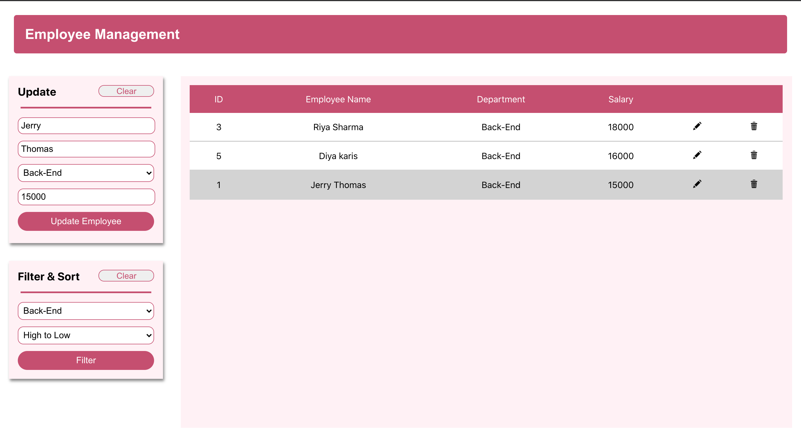
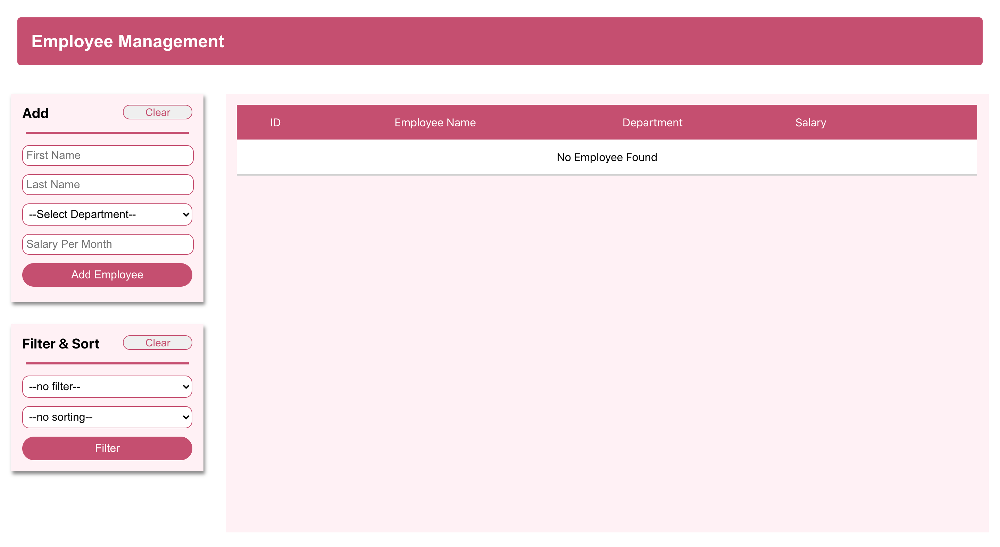
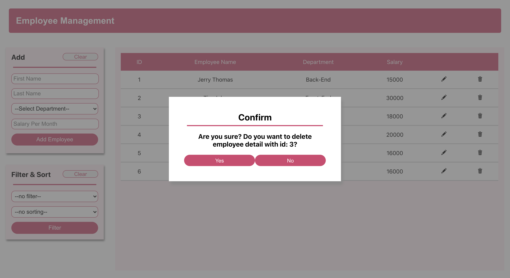
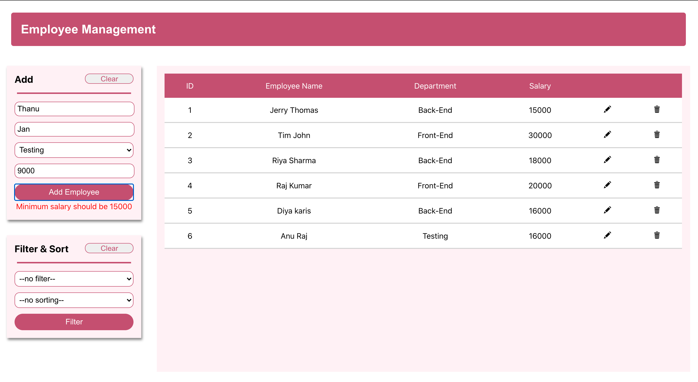

# React-SpringBoot-EmployeeMangement

_React-SpringBoot-Employee Management:_

### FRONT-END REACT:

This is application uses ReactJS as front-end. Fix the test case errors in the application. The test cases are written in Jest.

**Working of the Application**

This is app used to manage employee details.
It has basic CRUD, filter and sort functionalities.
The app consists of one "App" pages ,a "LeftBanner",a "Table" and a Modal component.
The app should be able to add, edit, update, delete, filter and sort.
App

It will contain header,LeftBanner,Table and Modal component in it.
All functions should be written in App.js and it should be pass it as a props to child component.

**LeftBanner**

- It should contain two division, one is for add and update employee and another one is for filter and sort.
- To add and update employee the form should contain basic validation else respective errors must be thrown.
- Based on mode the add and update should happen .
- On clicking add, employee details should be posted to backend.
- On clicking Update, employee details should be updated in backend.
- Filter should. be a select field, which should contain departments as options.
- Sorting with "low to high" ,should display the employee details in ascending order based on salary.
- Sorting with "high to low" ,should display the employee details in descending order based on salary.
- Filter and sorting will be applied to table on clicking filter button.
- Both division should have a clear button to clear the input fields and filter respectively.

**Table**

- It should display all the employee details with a edit and delete icon.
- On clicking edit icon respective employee details should be highlighted and it should displayed in the input fields to update.
- On clicking delete icon a Modal should be displayed to get confirmation to delete, if yes then the respective employee details should be deleted, else the Modal should be closed.

**Modal**
It contains a confirmation message, a "Yes" button and "No" button.

**Basic validation**

- All fields are mandatory to fill.
- FirstName and LastName should contian only alphabets and should contain minimum 3 characters
- Minimum value for salary should be 15000.

**Error Message**

These are the error message, which should be displayed on respective conditions.

- "All fields are mandatory to fill".
- "First/Last name should contain only alphabets."
- "First/Last name should contain atleast 3 characters."
- "Minimum salary should be 15000"

**Note:**

Any syntax errors or invalid statements or failures in your test cases will stop generating test report files and result in zero.
Api: **/api/employees.**

## Back-end Springboot:

You should make use of springboot and h2 database for back-end purposes.

**Models:**

There is a single model called employee that resides inside `Backend/src/main/java/com/tcs/employeeManagement/employee/Employee.java.` You should set the validations for the fields in the file as mentioned in the schema.

The schema for the model is given below:

| Name       |  Type   | Conditions and validations                                      |
| :--------- | :-----: | :-------------------------------------------------------------- |
| id         | Integer | Primary key, Auto increment                                     |
| firstName  | String  | Should have minimum 3 characters and only alphabets are allowed |
| lastName   | String  | Should have minimum 3 characters and only alphabets are allowed |
| department | String  |                                                                 |
| salary     | Integer | Minimum = 15000, Maximum = 200000                               |

**Endpoints:**

There is a file named EmployeeController.java that resides inside `Backend/src/main/java/com/tcs/employeeManagement/employee`. You should write code for all the endpoints inside this file. The endpoints in the route and their functionalities are given below,

1.

- _/employees_ - **get method** - should get all the employee details from the database.

There are some optional filters in this get route, their type and functionalities are given below,

- _/employees?dept=full-stack_ This route should get the data of the employees from the database having department as full-stack.

- _/employees?salary=asc_ This route should have to get the data of the employees from the database filtered in ascending order based on salary(if value is given as desc, then the data should be ordered in descending order based on salary).

- _/employees?dept=full-stack&salary=desc_ This route should have to get the data of the employees from the database having department as full-stack and they should be ordered in ascending order of their salary(if value is given as desc, then the data should be ordered in descending order based on salary).

- If fetching of data from the database was successful then you should return a response code of 200 isOk.

2. _/employees_ - **post method** - should save the details of the employee into the database sent data with the request.
   Example data sent wiht the request:
   {
   "firstName": "xxxxx",
   "lastName": "yyyy",
   "department": "zzzzzzzz",
   "salary": 25000
   }

- If all the data sent with request are valid and saved successfully in the database then you should return a response code of 201 isCreated.

- If any of the validation of data sent with the request got failed and data was not saved in the database then you should return a response code of 400 isBadRequest.

3. _/employees/{id}_ - **put method** - should update the data sent with the request if the data sent with it is valid for employee having id equals id sent with the request url

- Example request: /employees/2
  Example data sent with the request:
  {
  "lastName": "changeinname",
  }
- This request should update the lastName as changeinname for employee having id as 2.

- If the data sent with the body got successfully updated in the database then you should return a response code of 200 isOk.

4. _/employee/{id}_ - **delete method** - should delete the employee details having id equals id sent with the request url.

- Example request: /employees/4
- This request should have to delete the employee details having employee id as 4 from the database and should give a response code of 200 isOk on successful deletion.
